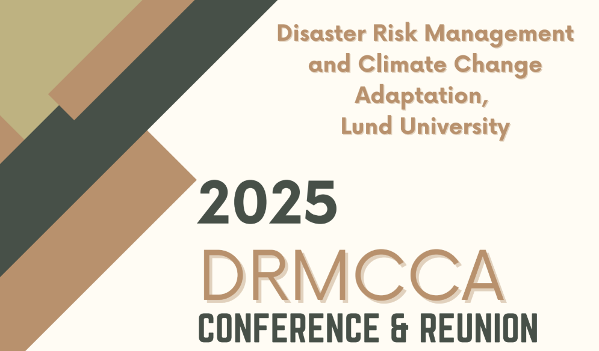

# Welcome to the Swag Bag!

Welcome to Your Disaster-Proof Swag Bag! 🌍⚡

Congratulations! You've just unlocked the ultimate survival kit for the 21st century — and no, it
doesn’t contain a lifetime supply of canned beans (though, maybe next time). This virtual swag bag is
your backstage pass to the essential knowledge on disaster risk management and climate change,
because let’s face it, the weather’s been acting a little extra lately.

Whether you're a seasoned climate crusader or just beginning your journey to understanding how our
planet is facing (and, fingers crossed, overcoming) these challenges, we've got the insights, tools, and
tips you need. From disaster preparedness to sustainable solutions, it’s time to take charge — not just
for you, but for the future of everyone on Earth.

Ready to dive in? Let’s start turning those “uh-oh” moments into “we’ve got this!” ones.

## Table of contents

